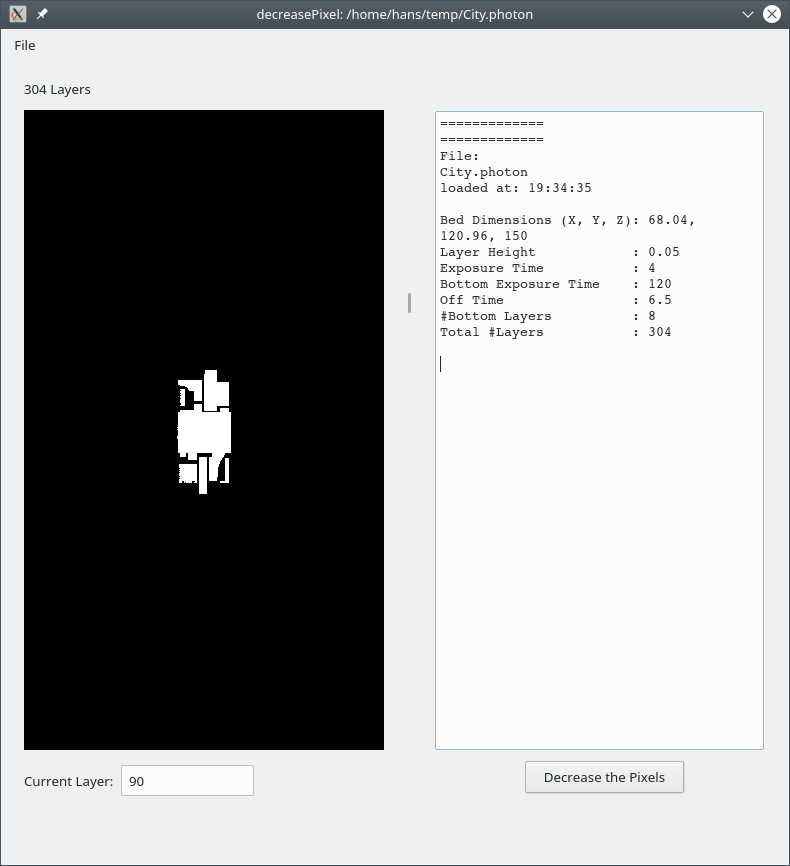

# Anycubic-Photon-decreasePixel-with-GUI

A simple utility that can adjust the pictures in a .photon file to fit design dimensions more closely.

When printing with the Anycubic Photon printer at the optimum exposure time, some light from the edge pixels bleeds through. This causes objects to be 100um wider in the XY dimensions, and holes to be 100um smaller in the XY dimensions. Objects are perfectly sized in the Z dimensions.

This utility reads a photon file and trims off all the edge pixels from each layer. That way all horizontal dimensions come out perfectly.

